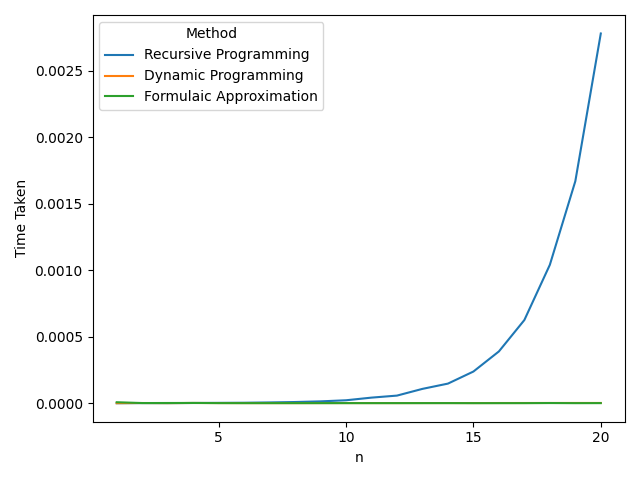
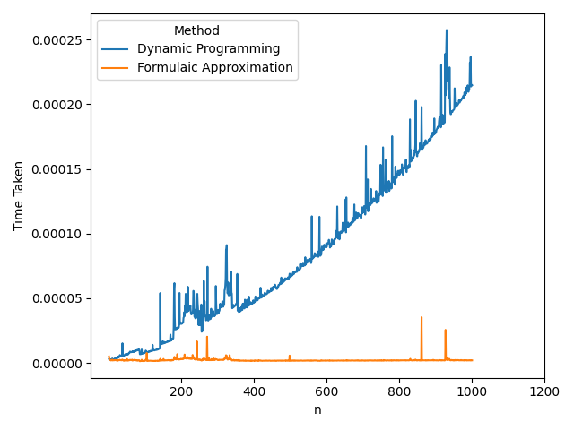
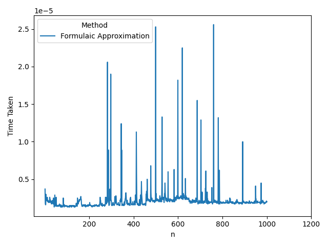

# An Investigation into Generic Algorithms and their Implementations

|               |                       |
|---------------|-----------------------|
|   Author      |   Ethan Tan Wee En    |
|   Language    |   Python (py)         |
|   Date        |   August 2021         |

## Fibonacci Sequence

Directory: `fibonacci`

3 algorithms are used to evaluate the fibonacci progression at any  position:
1.  Recursive Algorithm
2.  Dynamic Programming
3.  Formula ()

Here are the differences in the algorithms:

1.  Recursive Algorithm:
    *   Time Complexity: O(fib(n))
    *   Space Complexity: O(fib(n))

2.  Dynamic Programming Algorithm:
    *   Time Complexity: O(n)
    *   Space Complexity: O(1)

3.  Formulaic Algorithm:
    *   Time Complexity: O(1)
    *   Space Complexity: O(1) (0)

## Sorting Algorithms

Directory: `sorting`

## Tower of Hanoi

Directory: `tower_of_hanoi`

Minimal number of moves (basic): 2n - 1  
Minimal number of moves (constrained): 3n - 1

## References
